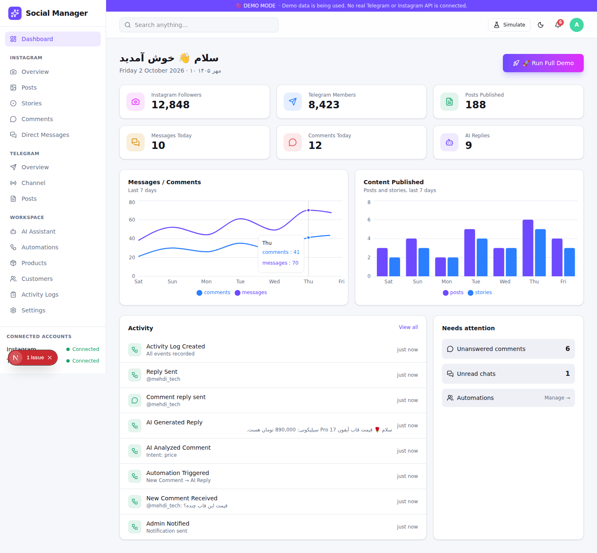

# Social Manager

Professional web admin panel for managing and automating a store's **Telegram** and **Instagram**: content automation (Telegram → Instagram posts/stories/reels), comment management, direct-message inbox, an AI customer assistant, products, customers, automations and activity logs.

> **Phase 1 — DEMO.** Only the web panel exists. All Telegram / Instagram / AI behaviour is mocked. No real API or token is used.
> No mobile app, Telegram bot or Mini App is included — the backend is API-based so they can be added later without rewrites.



## Tech stack
Next.js 16 (App Router, TypeScript) · Tailwind CSS 4 · React Query · Zod · Recharts · Lucide · next-themes · Sonner · Prisma + PostgreSQL (schema).

## Languages (Persian / English)
The panel is bilingual with full RTL support. Use the **EN / فا** button in the top bar (or on the login page); the choice is stored in a cookie (default: Persian).
Translations live in `src/i18n/fa.ts` — English text is the key, so adding a string means wrapping it in `t("...")`; a missing translation falls back to English. Numbers, dates and "x minutes ago" are localized (Persian digits in `fa`).

## Quick start (demo)
```bash
npm install
npm run dev        # http://localhost:3000
```
Login (pre-filled): `admin@socialmanager.demo` / `demo1234`

No database is needed for the demo: it runs on an in-memory store seeded with demo data (resettable from **Settings → General → Reset**). Data resets when the server restarts.

### Environment variables
Optional for the demo (safe dev defaults). See `.env.example`.

| Variable | Purpose |
| --- | --- |
| `NEXT_PUBLIC_APP_NAME` | Default product name (also editable in Settings). Single source: `src/config/app.ts` |
| `DEMO_MODE` | `true` uses mock providers. Real providers are not implemented yet |
| `SESSION_SECRET` | HMAC key for the session cookie — **set in production** |
| `DATABASE_URL` | PostgreSQL, used by Prisma (future phase) |
| `TELEGRAM_*`, `META_*`, `OPENAI_API_KEY` | Reserved for real integrations |

### Database (Prisma) — for the next phase
The full production schema is in `prisma/schema.prisma` (User, SocialAccount, TelegramChannel, InstagramAccount, Post, Story, Comment, DirectMessage, Conversation, Customer, Product, Automation, AutomationExecution, AISettings, ActivityLog, Notification, Settings).
```bash
cp .env.example .env              # set DATABASE_URL
npm run db:migrate                # prisma migrate dev
npm run db:generate
```
Then replace `src/database/store.ts` with Prisma repositories — services only depend on that object.

## Demo guide
1. **Dashboard → 🚀 Run Full Demo** — animated 10-step scenario: Telegram post → media → AI caption → Instagram post → story → comment → AI analysis → AI reply → reply sent → activity log.
2. **Simulate** menu (top bar): Telegram post, Instagram comment, Instagram DM, new customer. Each runs through the real backend pipeline, then updates every page, the activity log and notifications.
3. **Automations**: toggle the Telegram → Instagram options (post/story/reel/AI caption/hashtags/notify), pause automations (simulations then respect it), open one for the visual workflow.
4. **Direct Messages**: three-pane inbox; *AI Reply* answers from the product catalog. **AI Assistant**: tone, business knowledge, rules, and a Test Chat.
5. Dark/light mode, mobile drawer, cards-instead-of-tables on small screens.

## Architecture
```
src/
  app/            routes (pages) + app/api (REST endpoints)
  modules/        feature UIs (dashboard, instagram, telegram, ai, automations, ...)
  components/     ui/ (primitives), layout/, shared/
  services/       business logic, independent of UI
    providers/      TelegramProvider · InstagramProvider · AIProvider (interfaces)
      mock/           Mock* implementations used in demo
    automation/     pipeline + event handlers (telegram→instagram, comment, DM, customer, full demo)
    instagram, telegram, ai, customer, products, activity, dashboard
  database/       store.ts (in-memory) + seed.ts   ← swap for Prisma
  lib/            api wrapper (auth + RBAC + rate limit + validation), security/, utils
  hooks/ types/ utils/ config/
prisma/           production schema
```
Key ideas:
- **UI never contains business logic** — pages call REST endpoints; endpoints call services; services call providers.
- **Provider registry** (`services/providers/index.ts`) is the only place that decides mock vs real.
- **Every API route** is wrapped by `api()` (`src/lib/api.ts`): signed-cookie auth → role check (`admin/editor/viewer`) → rate limit → Zod validation → error mapping. A Telegram bot or mobile app can call the same endpoints.
- **Security (even in demo)**: secrets only via env, tokens masked server-side, HttpOnly signed session, route protection via `proxy.ts`, webhook verification helpers (`lib/security/secrets.ts`).

### API (all require login except auth)
`GET /api/posts|stories|comments|messages|customers|products|automations|logs|notifications|telegram|dashboard|settings`,
`PATCH /api/comments/:id`, `POST|PATCH /api/messages/:id`, `POST|PATCH|DELETE /api/products[/:id]`, `PATCH /api/automations/:id`, `PUT /api/ai/settings`, `POST /api/ai/chat`,
demo events: `POST /api/demo/telegram/post`, `/instagram/comment`, `/instagram/message`, `/customer`, `/automation/run`, `/full`.
Webhook endpoints (`/api/webhooks/telegram`, `/api/webhooks/instagram`) exist as verified stubs and return 501 in demo mode.

## Future real API integration (next phase)
1. `TelegramBotProvider` (Bot API) + webhook at `/api/webhooks/telegram` (secret-token check) feeding `simulateTelegramPost`'s logic.
2. `InstagramGraphProvider` (Meta Graph API) + Meta OAuth + `/api/webhooks/instagram` (signature check) for comments/DMs/publishing.
3. `OpenAIProvider` implementing `AIProvider`.
4. Prisma repositories + encrypted token storage; background queue for publishing; Redis rate limiter.
5. Register them in `getProviders()` and set `DEMO_MODE=false`.
